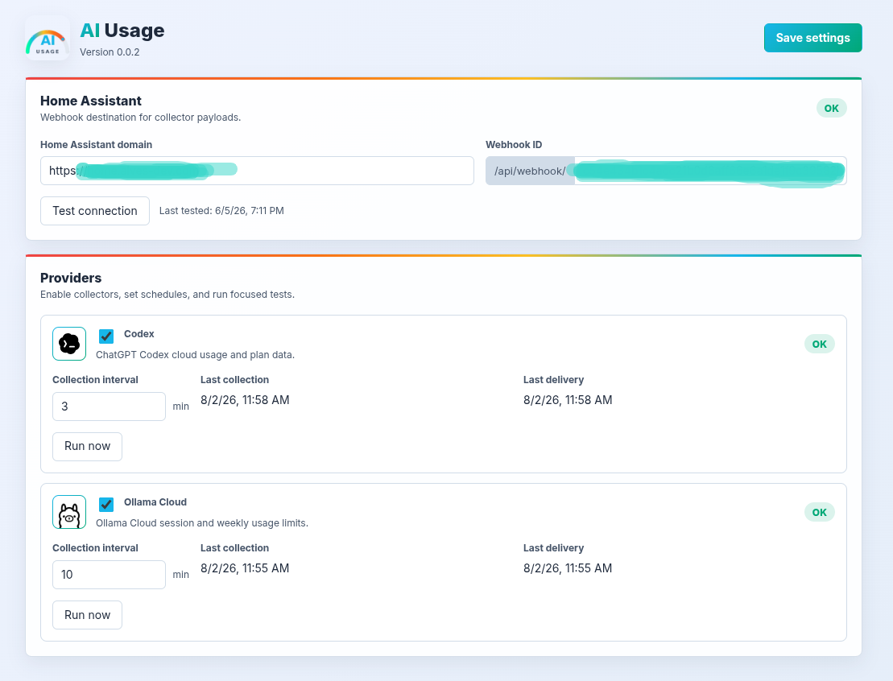

# AI Usage Collector

[](https://sonar.alves-dev.com/dashboard?id=ai-usage-extension)
[](https://sonar.alves-dev.com/dashboard?id=ai-usage-extension)
[](https://sonar.alves-dev.com/dashboard?id=ai-usage-extension)
[](https://sonar.alves-dev.com/dashboard?id=ai-usage-extension)
[](https://sonar.alves-dev.com/dashboard?id=ai-usage-extension)

Manifest V3 extension that acts as a client/collector for the Home Assistant integration in [alves-dev/ai-usage](https://github.com/alves-dev/ai-usage). It collects AI provider usage data from the browser's authenticated session and sends structured payloads to a Home Assistant webhook.

## How It Works

The extension runs a background service worker. For each enabled provider, it schedules periodic collections with `chrome.alarms`, accesses the provider endpoints or pages using the browser's existing authenticated session, and normalizes the result to the contract documented in [`docs/payload-contract.md`](docs/payload-contract.md).

After each collection, the payload is sent with `POST` to the configured Home Assistant webhook. The extension does not store provider tokens and does not send cookies, raw HTML, or API keys in the payload.

## Supported Providers

- **Codex**: collects plan and usage limit data for Codex Cloud on `chatgpt.com`.
- **Ollama Cloud**: collects account, plan, and usage limit data from the Ollama Cloud settings page.

Each provider can be enabled or disabled independently on the options page, with a configurable collection interval in minutes.

## Options Page



## Home Assistant Configuration

On the extension options page, configure:

1. **Home Assistant domain**: the HA base domain, for example `https://ha.example.com`.
2. **Webhook ID**: only the webhook ID, for example `ai_tools_usage_xxxxx`.

The extension builds the final URL as:

```text
https://ha.example.com/api/webhook/ai_tools_usage_xxxxx
```

The **Test connection** button sends a test payload. If Home Assistant returns `400`, the test is considered successful because it confirms the request reached HA even though the test contract is invalid.

## Local Installation

1. Open `chrome://extensions` in a Chromium-based browser.
2. Enable **Developer mode**.
3. Click **Load unpacked**.
4. Select this repository folder.
5. Open the extension options page and configure the webhook.

After changing local files, reload the extension from `chrome://extensions`.

## Development

There is no build step or bundler. Source code lives in `src/`:

- `src/background/`: service worker and page probe logic.
- `src/options/`: configuration UI.
- `src/providers/`: provider collectors.
- `src/services/`: storage, scheduler, and Home Assistant client.
- `src/utils/`: constants, normalization, and Chrome API wrappers.

Available command:

```bash
npm run check
```

This runs `node --check` for every JavaScript file in `src/`.

## Documentation

- [`docs/payload-contract.md`](docs/payload-contract.md): payload contract sent to Home Assistant.
- [`docs/codex-collector.md`](docs/codex-collector.md): Codex collection details.
- [`docs/ollama-cloud-collector.md`](docs/ollama-cloud-collector.md): Ollama Cloud collection details.

## Security

Do not commit private webhook URLs, real provider responses, or account data. The extension depends on browser permissions to access the Home Assistant domain and the provider domains configured in `manifest.json`.
